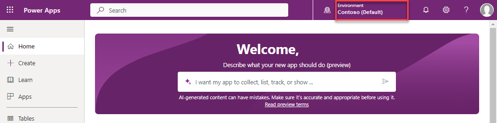
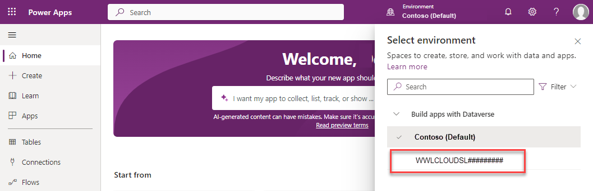

---
lab:
    title: 'Learning Path 1 - Lab 1.1: Work with customer engagement apps'
    learning path: 'Explore the core capabilities of Microsoft Dynamics 365 customer engagement apps'
    module: 'Describe the foundations of Dynamics 365 customer engagement apps'
---

Learning Path 1 - Module 1: Describe the foundations of Dynamics 365 customer engagement apps
========================

## Practice Lab 1.1 - Work with customer engagement apps 

## Objectives

In this exercise, you will become familiar with how to access and navigate different Dynamics 365 customer engagement applications. 

## Lab Setup

  - **Estimated Time**: 10 minutes

## Instructions

1. In a web browser, navigate to [https://make.powerapps.com](https://make.powerapps.com/). 

2. Login with the credentials provided to you by your instructor. When you first login, you will be taken to the **Contoso (default)** environment. Typically, you will not work in the default environment. We are going to change it to a dedicated environment for training. 

3.  Using the environment selector at the top, select the environment **Contoso (default).** 

4. From the menu that appears, select the dedicated training environment noted by your instructor. (For hosted training tenants, the environment will likely begin with something such as **WWLCLOUD.**)

5. Once you are working in the correct environment, using the navigation on the left, select **Apps**. 

6. In the list of **Apps**, open the **Sales Hub** application. When you are within an app, there will be different areas that you can work with based on what you are trying to do. For example, the Sales Hub application contains different administrative settings that you can work with.

7. On the lower left side of the screen, at the very bottom of the left-hand navigation pane or **Site Map**, select the text **Sales**, from the list that appears, select **App Settings.** **App Settings** is where you can review and make changes to administrative settings. Notice how the left-hand navigation items have changed.

8. Select the **Change Area** selector again and change it from **App Settings** back to **Sales**.

9. If you want to switch from the Sales app to a different app such as Customer Service workspace, select the **Sales Hub** text in the upper left part of the screen next to the text Dynamic 365.

10.  The **Apps** selector pop-up will appear, select **Customer Service Hub** and you will be taken to the **Customer Service Hub** application. Notice the **Customer Service Hub** has different areas available in the **Change Area** menu.

11. To switch back to the **Sales Hub** app, select the **Customer Service Hub** text at the top which opens the **Apps** selector pop-up. Select **Sales Hub**.

Alternatively, you can access Business applications from the Microsoft 365 portal.

12. In a web browser, navigate to [https://www.microsoft365.com/apps](https://www.microsoft365.com/apps). All the applications that you have access to will be displayed.

13. Select the **Business Apps** tab to limit the applications that are being displayed to only show Dynamics 365 business applications.

14. Select the **Sales Hub** app to open it.

15. When you are within an app, there will be different areas that you can work with based on what you are trying to do. For example, the Sales Hub application contains different administrative settings that you can work with.

16. On the lower left side of the screen, select the text **Sales**, from the list that appears, select **App Settings.** This part of the application is where you can make administrative changes to it.

17. Select the Area selector again and change it from **App Settings** back to **Sales**.

18. If you want to switch from the Sales app to a different app such as Customer Service hub, select the **Sales Hub** text in the upper left part of the screen next to the text Dynamic 365.

19. The Apps screen will appear, select **Customer Service Hub** and you will be taken to the Customer Service Hub Application.

20. Select the **Customer Service Hub** text at the top to switch back to the **Sales Hub** App.
